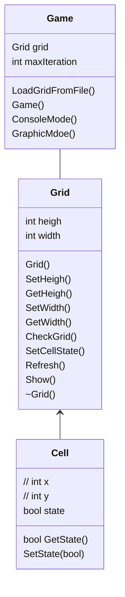
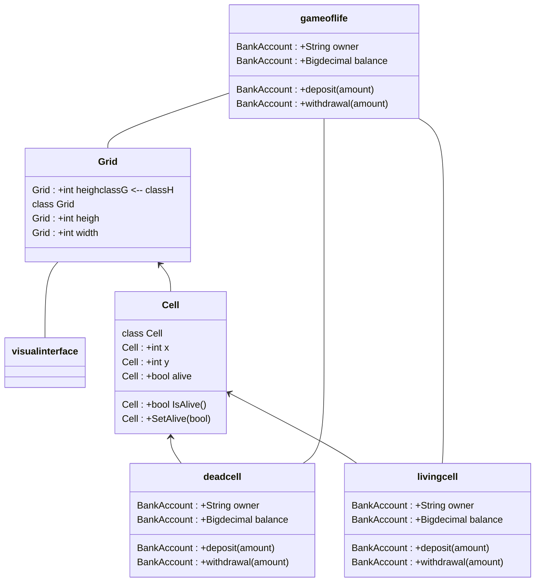

```table-of-contents
title: **Sommaire**
style: nestedList # TOC style (nestedList|nestedOrderedList|inlineFirstLevel)
minLevel: 0 # Include headings from the specified level
maxLevel: 0 # Include headings up to the specified level
include: 
exclude: 
includeLinks: true # Make headings clickable
hideWhenEmpty: false # Hide TOC if no headings are found
debugInConsole: false # Print debug info in Obsidian console
```

# Introduction

## Contexte


## Livrables


---
# diagrammes







## La visibilité

La visibilité permet de définir l'encapsulation.


| **caratère** | **rôle**       | **mot clé** | **Description**                                                                      |
| ------------ | -------------- | ----------- | ------------------------------------------------------------------------------------ |
| +            | accès publique | public      | toutes les autres classes ont accès à cet attribut.                                  |
| #            | accès protégé  | protected   | Seules a classe elle-même et les classes filles (héritage) ont accès à cet attribut. |
| ~            | accès package  | package     | Classe visible uniquement dans le package.                                           |
| -            | accès privé    | private     | Seule la classe elle-même a accès à cet attribut.                                    |


---
# github

## syntaxe git
### Initialiser un projet

```bash
git init
git add .
git commit -m "initial commit"
git branch -M main
git remote add origin https://github.com/TON_USER/TON_REPO.git
git push -u origin main
```

---

### Faire un push (workflow standard)

1. Vérifier l'état du dépôt (optionnel)
```bash
git status
```

2. Ajouter les fichiers
```bash
git add .
```

3. Commit
```bash
git commit -m "message"
```

4. Récupérer les changements distants avant d'envoyer
```bash
git pull --rebase
```

5. Pousser vers GitHub
```bash
git push
```

---

### Erreurs lors d’un push

#### Erreur : "fetch first" ou "rejected"

Cela arrive lorsqu'il y a des commits sur GitHub qui ne sont pas en local sur le pc.

Solution :
```bash
git pull --rebase
git push
```

---

### Erreurs lors d’un pull

#### 1. Fichiers locaux modifiés, pull impossible

Message typique :

```
Your local changes would be overwritten
```

##### Solution si l'on souhaite garder les modifications

```bash
git stash
git pull
git stash pop
```

##### Solution si l'on souhaite tout écraser par GitHub

```bash
git reset --hard
git pull
```


---

### Commandes utiles en cas de problème

| Action                                   | Commande              |
| ---------------------------------------- | --------------------- |
| Voir l’état du dépôt                     | `git status`          |
| Annuler un `git add`                     | `git reset <fichier>` |
| Annuler tous les `add`                   | `git reset`           |
| Annuler toutes les modifications locales | `git reset --hard`    |
| Stocker temporairement les modifications | `git stash`           |
| Restaurer le stash                       | `git stash pop`       |
| Récupérer les infos du dépôt distant     | `git fetch`           |

---

### Qu’est-ce que le rebase ?

Le rebase est une façon de **mettre à jour l'historique en le réécrivant proprement**.

Lorsque l'on fais :

```bash
git pull --rebase
```

Git fait ceci :

1. Il récupère les commits de GitHub.
2. Il met temporairement nos commits de côté.
3. Il place les commits de GitHub dans l’historique.
4. Il "rejoue" nos commits au-dessus, comme s’ils avaient été faits après.

Cela donne un historique propre, linéaire, sans “Merge commit”.

#### Exemple simple

Historique avant rebase (désordonné) :

```
A - B - C (GitHub)
        \
         D - E (t(utilisateur)``

Après `git pull --rebase` :
         D - E (utilisateur)
```

Après `git pull --rebase` ```
:

```
A - B - C - D - E
```

Le code est toujours là, mais reposé dans le bon ordre.

Le rebase évite les conflits inutiles et permet un historique propre et lisible.


## Lexique des types de commits

| Type         | Signification                                 | Quand l’utiliser ?                     | Exemple                              |
| ------------ | --------------------------------------------- | -------------------------------------- | ------------------------------------ |
| **feat**     | Nouvelle fonctionnalité                       | Tu ajoutes quelque chose au programme  | `feat: add XOR encryption`           |
| **fix**      | Correction de bug                             | Tu corriges un comportement incorrect  | `fix: correct Caesar shift overflow` |
| **docs**     | Documentation uniquement                      | README, commentaires, wiki             | `docs: add UML diagrams`             |
| **style**    | Mise en forme (pas de code logique)           | formatage, indentation, espaces        | `style: format source files`         |
| **refactor** | Changement interne sans modifier les features | réorganisation, simplification du code | `refactor: clean encryption classes` |
| **perf**     | Amélioration de performance                   | code plus rapide ou plus léger         | `perf: optimize XOR algorithm`       |
| **test**     | Ajout ou modification de tests                | tu touches aux tests uniquement        | `test: add tests for mixed mode`     |
| **build**    | Changement dans le système de build           | CMake, Makefile, dependances           | `build: update CMake version`        |
| **ci**       | Changement dans l’intégration continue        | GitHub Actions, pipelines              | `ci: fix workflow permissions`       |
| **chore**    | Tâches sans impact sur le code source         | maj deps, nettoyage, scripts           | `chore: remove temp files`           |
| **revert**   | Annule un commit précédent                    | rollback                               | `revert: undo broken refactor`       |
### les scopes

il y a possibilité d'ajouter un **scope** entre parenthèses :
>feat(ui): add dark mode toggle 
>fix(xor): correct key overflow 
>docs(readme): add usage examples

les scopes dans un commit permet d'indiquer la parties modifier.
### BREAKING CHANGE et " ! "

#### BREAKING CHANGE
Un **BREAKING CHANGE** signifie :
> **Un changement qui casse la compatibilité avec l’ancienne version.**  
> Autrement dit : le code d’avant ne fonctionne plus comme avant.

Exemples :
- le changement d'une fonction publique → son nom ou ses paramètres ne sont plus les mêmes
- la suppression d'une classe, une méthode, un fichier utilisé ailleurs
- la modification d'un comportement attendu qui va casser le programme de quelqu’un

Dans les conventions, l'annonce dans le message de commit :
>`feat(api): rewrite encrypt function  BREAKING CHANGE: encrypt() now requires a key parameter.`

#### " ! "

Le **!** est une manière _courte_ d’indiquer une breaking change sans écrire le texte complet.

Exemples :
>`feat!: remove old encryption algorithm`


---


<html>
<head>
  <meta charset="utf-8">
  <meta name="viewport" content="width=device-width, initial-scale=1.0">
  <title>Projet</title>
  <link rel="stylesheet" href="https://stackedit.io/style.css" />
</head>

<body class="stackedit">
  <div class="stackedit__html"><h1 id="projet-poo--le-jeu-de-la-vie">Projet POO : le jeu de la vie</h1>
<h2 id="énoncé">Énoncé</h2>
<p>Le jeu de la vie désigne un automate cellulaire proposé par le mathématicien John Conway. Il décrit l’évolution d’une population de cellules sur un intervalle de temps discret. Les cellules placées dans une grille rectangulaire deux dimensionnelle sont caractérisées par deux états ; elles sont soit vivantes, soit mortes. A l’exclusion des bordures, le voisinage d’une cellule est formé par 8 autres cellules directement adjacentes. Pour passer de l’itération <span class="katex--inline"><span class="katex"><span class="katex-mathml"><math xmlns="http://www.w3.org/1998/Math/MathML"><semantics><mrow><mi>t</mi></mrow><annotation encoding="application/x-tex">t</annotation></semantics></math></span><span class="katex-html" aria-hidden="true"><span class="base"><span class="strut" style="height: 0.61508em; vertical-align: 0em;"></span><span class="mord mathnormal">t</span></span></span></span></span> à l’itération <span class="katex--inline"><span class="katex"><span class="katex-mathml"><math xmlns="http://www.w3.org/1998/Math/MathML"><semantics><mrow><mi>t</mi><mo>+</mo><mn>1</mn></mrow><annotation encoding="application/x-tex">t+1</annotation></semantics></math></span><span class="katex-html" aria-hidden="true"><span class="base"><span class="strut" style="height: 0.69841em; vertical-align: -0.08333em;"></span><span class="mord mathnormal">t</span><span class="mspace" style="margin-right: 0.222222em;"></span><span class="mbin">+</span><span class="mspace" style="margin-right: 0.222222em;"></span></span><span class="base"><span class="strut" style="height: 0.64444em; vertical-align: 0em;"></span><span class="mord">1</span></span></span></span></span>, l’état des cellules dans la grille est actualisé selon les règles suivantes :</p>
<ul>
<li>Une cellule morte possédant exactement trois voisines vivantes devient vivante.</li>
<li>Une cellule vivante possédant deux ou trois voisines vivantes reste vivante, sinon elle meurt.</li>
</ul>
<p>Vous proposerez une implémentation en C++ du jeu de la vie en vous reposant sur les concepts de la programmation orientée objet. En entrée, votre programme consommera un fichier dont la première ligne permettra de spécifier la taille de la grille. Suivra une matrice de booléens, décrivant l’état initial, vivant (1) ou mort (0) des cellules. Par exemple :</p>
<pre><code>5 10
0 0 1 0 0 0 0 0 0 0
0 0 0 1 0 0 0 0 0 0
0 1 1 1 0 0 0 0 0 0
0 0 0 0 0 0 0 0 0 0
0 0 0 0 0 0 0 0 0 0
</code></pre>
<p>Pour aboutir vous formerez des groupes de 2 étudiants. L’utilisation de GIT par tous les membres du projet sera indispensable. L’évaluation portera sur les éléments suivants :</p>
<ul>
<li>la réponse au besoin</li>
<li>la qualité du code</li>
<li>la robustesse du programme</li>
<li>la mise en oeuvre des concepts de POO</li>
<li>le niveau d’aboutissement</li>
<li>la maitrîse du programme par le groupe</li>
</ul>
<p>Ce projet sera le fruit d’un travail limité aux membres d’un groupe. Toute tentative de plagiat, toute ressemblance entre les codes livrés, toute incapacité à décrire le programme et le code fourni seront sanctionnées.</p>
<h2 id="spécifications-techniques">Spécifications techniques</h2>
<ul>
<li>Implémenter votre programme de sorte à faire au maximum usage des concepts de la POO en C++. L’objectif n’est pas d’aboutir à un programme procédural. Le respect des principes SOLID sera déterminant, par exemple il s’agira d’appliquer les contraintes suivantes :
<ul>
<li>Le jeu, la grille et les cellules seront implémentés sous forme de classes.</li>
<li>L’état des cellules sera représenté à l’aide d’une hiérarchie de classes et exploitera le polymorphisme d’héritage.</li>
<li>Les règles de calcul de l’état d’une cellule, dont le comportement pourra être redéfini à l’avenir, seront implémentées dans une hiérarchie de classes indépendante.</li>
<li>Il faudra bien séparer les responsabilités : la partie visuelle (GUI) sera découplée de la partie logique métier (fonctionnement du jeu de la vie).</li>
</ul>
</li>
<li>Lors de la phase de conception, modéliser votre programme avec les diagrammes suivants :
<ul>
<li>Diagramme de classes.</li>
<li>Diagramme d’activité.</li>
<li>Diagramme de séquence.</li>
</ul>
</li>
<li>Développer votre programme en C++ standard.
<ul>
<li>S’appuyer sur la bibliothèque standard C++ STL.</li>
<li>Utilisation de la bibliothèque graphique SFML pour le développement de votre interface graphique.</li>
</ul>
</li>
<li>Le programme doit être implémenté de manière efficace.</li>
</ul>
<h2 id="spécifications-fonctionnelles">Spécifications fonctionnelles</h2>
<ol>
<li>L’utilisateur lance le programme et fournit le chemin du fichier contenant l’état initial des cellules en paramètre.</li>
<li>Le programme consomme le fichier avec le format précédemment décrit et génère l’ensemble des objets du programme (grille, cellules).</li>
<li>À chaque itération les cellules changent d’état selon les règles énoncées plus haut.</li>
<li>L’exécution se termine lorsque l’automate n’évolue plus ou après un nombre d’itération fixé arbitrairement.</li>
<li>Deux modes de fonctionnement seront implémentés :
<ul>
<li>Le premier, en mode console, fournira les états des <span class="katex--inline"><span class="katex"><span class="katex-mathml"><math xmlns="http://www.w3.org/1998/Math/MathML"><semantics><mrow><mi>n</mi></mrow><annotation encoding="application/x-tex">n</annotation></semantics></math></span><span class="katex-html" aria-hidden="true"><span class="base"><span class="strut" style="height: 0.43056em; vertical-align: 0em;"></span><span class="mord mathnormal">n</span></span></span></span></span> premières itérations de votre jeu de la vie. À chaque itération le programme écrit l’état des cellules dans un fichier selon le format décrit précédemment. Ces résultats sont stockés dans des dossiers nommés <code>&lt;nom_du_fichier_dentree&gt;_out</code> et utilisés pour correction.</li>
<li>Le second, en mode graphique, affiche la grille et l’état des cellules sur une interface graphique. Pour aboutir, vous disposez d’un exemple de code capable d’afficher une fenêtre graphique et une grille de cellules. Celui-ci devra être adapté en une version orientée objet. La simulation démarre au lancement du programme. La durée entre deux itérations est contrôlable.</li>
</ul>
</li>
</ol>
<ul>
<li>L’application contiendra impérativement une ou plusieurs fonctions de tests unitaires capables de vérifier l’état de la grille après un nombre arbitraire d’itérations. Elle sera ainsi paramétrée par la grille attendue et un nombre d’itérations.</li>
</ul>
<h3 id="extensions-points-bonus">Extensions (points bonus)</h3>
<ol>
<li><strong>Gestion d’une grille torique.</strong> Les cellules placées aux extrémités de la grille sont adjacentes ; en d’autres termes les cellules en colonne <span class="katex--inline"><span class="katex"><span class="katex-mathml"><math xmlns="http://www.w3.org/1998/Math/MathML"><semantics><mrow><mn>0</mn></mrow><annotation encoding="application/x-tex">0</annotation></semantics></math></span><span class="katex-html" aria-hidden="true"><span class="base"><span class="strut" style="height: 0.64444em; vertical-align: 0em;"></span><span class="mord">0</span></span></span></span></span> sont voisines des cellules en colonne <span class="katex--inline"><span class="katex"><span class="katex-mathml"><math xmlns="http://www.w3.org/1998/Math/MathML"><semantics><mrow><mi>N</mi><mo>−</mo><mn>1</mn></mrow><annotation encoding="application/x-tex">N - 1</annotation></semantics></math></span><span class="katex-html" aria-hidden="true"><span class="base"><span class="strut" style="height: 0.76666em; vertical-align: -0.08333em;"></span><span style="margin-right: 0.10903em;" class="mord mathnormal">N</span><span class="mspace" style="margin-right: 0.222222em;"></span><span class="mbin">−</span><span class="mspace" style="margin-right: 0.222222em;"></span></span><span class="base"><span class="strut" style="height: 0.64444em; vertical-align: 0em;"></span><span class="mord">1</span></span></span></span></span>, avec <span class="katex--inline"><span class="katex"><span class="katex-mathml"><math xmlns="http://www.w3.org/1998/Math/MathML"><semantics><mrow><mi>N</mi></mrow><annotation encoding="application/x-tex">N</annotation></semantics></math></span><span class="katex-html" aria-hidden="true"><span class="base"><span class="strut" style="height: 0.68333em; vertical-align: 0em;"></span><span style="margin-right: 0.10903em;" class="mord mathnormal">N</span></span></span></span></span> le nombre de colonnes. Le principe est similaire en ligne.</li>
<li><strong>Introduction de cellules obstacles.</strong> L’état des cellules obstacles n’évolue pas au cours de l’exécution. Ces dernières possèdent un état vivant ou mort. Modifiez votre code, sans altérer le fonctionnement de base.</li>
<li><strong>Placement de constructions pré-programmées sur la grille.</strong> Utilisez les touches du clavier pour intégrer de nouveaux motifs sur la grille lors de l’exécution.</li>
<li><strong>Paralléliser la génération des cellules.</strong> Modifiez votre algorithme pour paralléliser le traitement requis pour mettre à jour l’état des cellules sur la grille.</li>
</ol>
</div>
</body>
</html>